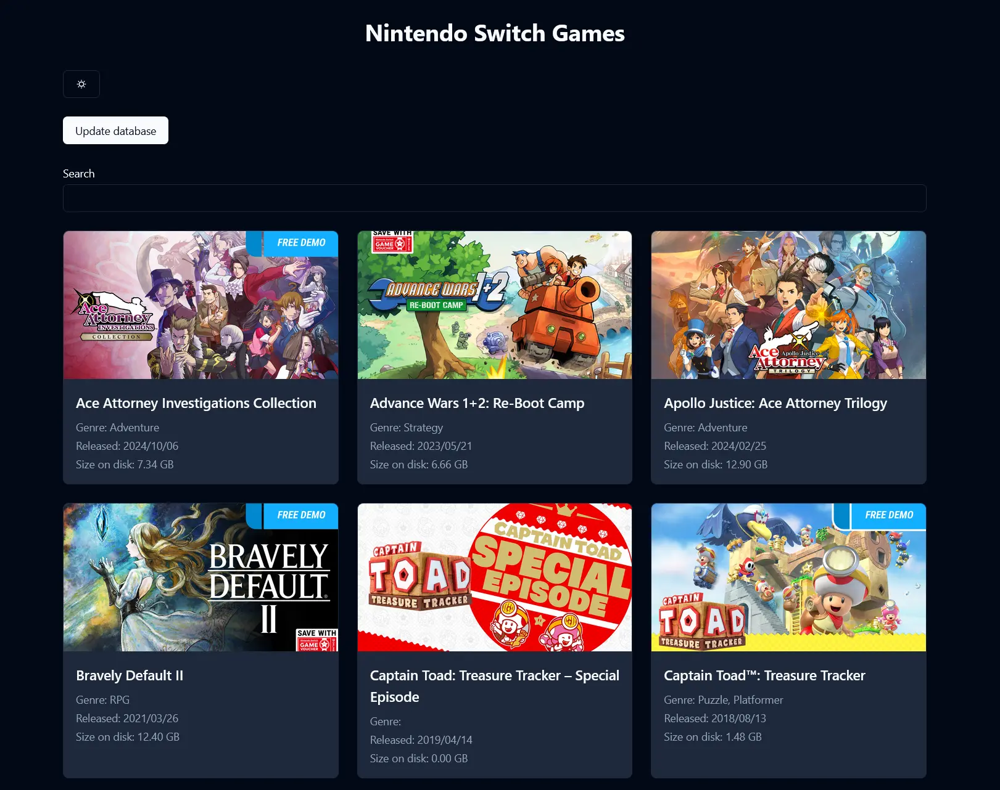

# switch-ui

A frontend for your locally stored and legally obtained (dumped) switch games.

The backend scans a directory (docker volume) on your machine where your games are stored in xci, nsp or nsz format. It then tries to find the game's titleId with a regexp and finally matches it to a game in the database.

## Features

- Automatically maintain database with a cron job (once a day)
- Manually update database and scan filesystem
- Display a list of your switch games
- Filter games based on search query or category
- Dark & Light mode

## How to run

1. Clone the project somewhere on your machine
2. Edit the compose.yaml file to your needs
3. `docker compose up -d` !
4. Visit http://localhost:3000 (or your domain if you set up a reverse proxy)

## Stack

- Solid Start
- TypeScript
- Uno CSS
- tRPC
- Drizzle and SQLite
- https://shadcn-solid.com/
